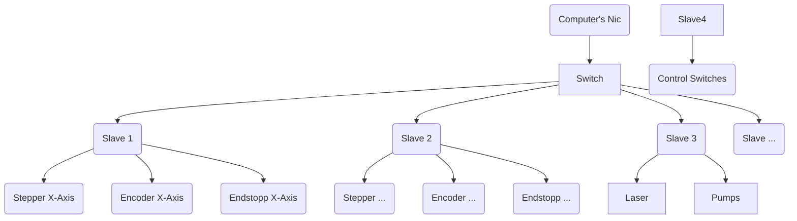

# ByteCNC Slave
___

### Project Description:

Something like Worker/Sub-Controller for Stepper Drivers, I/Os...

A worker is connected to a main controller via an 8-wire network cable. The workers can communicate with each other via a TCP protocol. If a critical signal is triggered, a special analog line is pulled high and, for example, steppers immediately go into hold.

This means that the workers work in a network that uses both digital and analog signals. Digital communication takes place via the TCP protocol, which enables reliable data transmission. Analog communication takes place via a special line that is reserved for emergencies only. If this line is activated, all worker movements stop immediately to prevent damage.

### Project Graph:

### Software:
The ID of a controller is unique and is stored on an EProm, together with the settings for the various operating modes. This enables quick and flexible adaptation to different requirements and situations.

The workers are not equipped with their own logic, but only follow predefined instructions that are similar to a GCode (Slave XXXXX -> Goto XXXXX). These instructions are repeated until a "break" command is sent or an end button is reached, for example.

### Hardware:

[//]: # (https://www.instructables.com/State-machine-and-multitasking-on-arduino-with-SPI/)

- ESP32 (ESP32-WROVER-E)
- Digital I/O Expander (MCP23S17/SPI)
- Analog DAC (MCP4921/SPI)
- Analog ADC (MCP3004/SPI)
